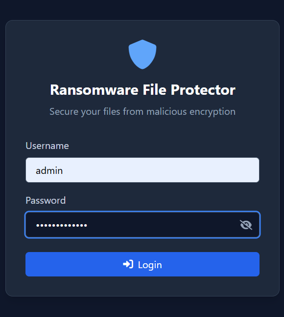
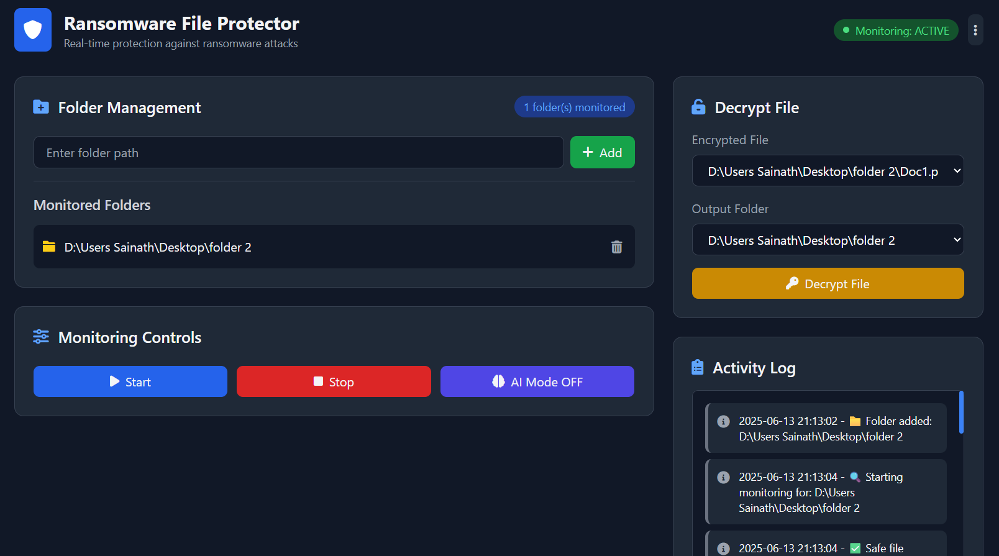
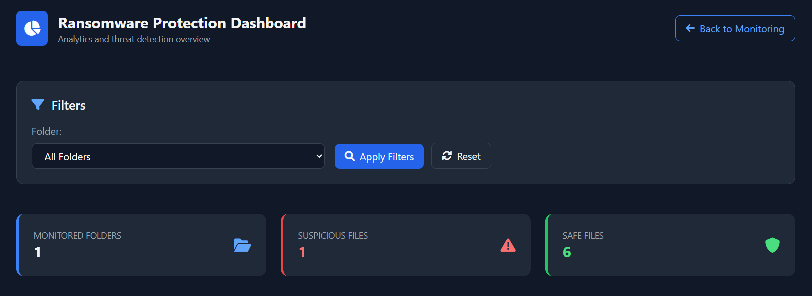
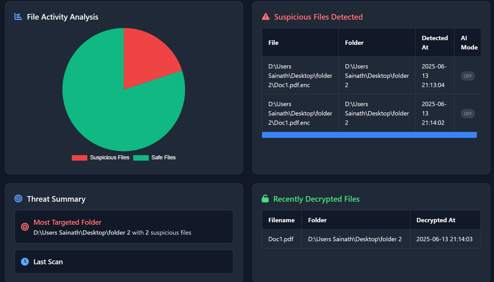

> **NOTICE:** This project is proprietary. The source code is published for
> demonstration and recruitment purposes only. Reuse, distribution, or
> modification is prohibited without written permission from Sanket S Patwalkar.

# DeepShield – AI-driven shield against ransomware

## Overview
The DeepShield – AI-driven shield against ransomware is a web-based cybersecurity tool designed to detect, monitor, and mitigate ransomware attacks in real time. It leverages Python and the Flask framework to provide an intuitive user interface, while integrating file system monitoring using the Watchdog library. The system continuously tracks selected folders for suspicious file behavior, such as unauthorized encryption or extension changes.

## Features
- User Login and Authentication
- Folder Monitoring and Log Display
- Suspicious File Detection and Backup
- AI-Powered File Analysis
- Decryption of Encrypted Files

## Screenshots
### Login Page

### Main page

### Dashboard

## Future scope
- In the future, this system can be enhanced to automatically block suspicious processes or 
isolate infected files.
- A mobile application can be developed to allow users to monitor activity and receive alerts 
on the go.
- Email or SMS alerts can be integrated to notify users immediately when suspicious file 
activity is detected.

## Note
Source code is private. Recruiters can request access.
